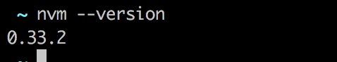
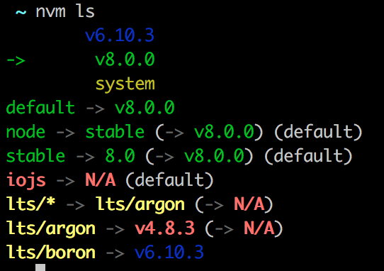
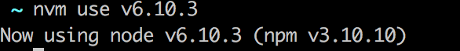
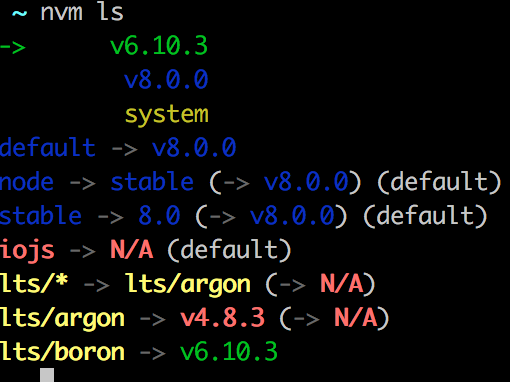
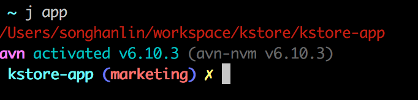
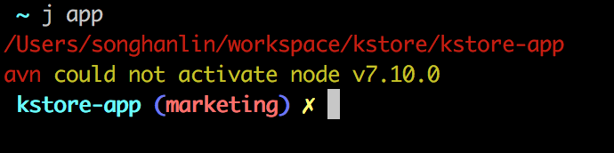

在前端飞速发展的这个时代, node 的出现也让更多不可能的事情变成可能. 随即出现的一个问题就是不同的项目可能会存在不同 node, 如果更好的管理 node 版本, 解放人的工作量开始成为一个问题. 本文使用 nvm 和 avn 来解决这个问题.

## [NVM](https://github.com/creationix/nvm)

### 下载

```bash
$ curl -o- https://raw.githubusercontent.com/creationix/nvm/v0.33.8/install.sh | bash
```

注意: 可查看官网, 中间版本号会改变

### 环境变量

加入到配置文件中,可能是(~/.bash_profile, ~/.zshrc, ~/.profile, or ~/.bashrc )
我这边使用了 zsh,所以直接加入到~/.zshrc 中即可 配置如下:

```bash
export NVM_DIR="$HOME/.nvm"
[ -s "$NVM_DIR/nvm.sh" ] && . "$NVM_DIR/nvm.sh"
```

### 执行

```bash
$ source .zshrc
```

这个时候就可以退出终端,重新打开终端,验证是否安装成功.再次进入终端 输入

```bash
$ nvm --version
```


显示出版本号即表示安装成功,下面可以使用 nvm 来下载多版本 node

##### 下载

```bash
$ nvm install v6.10.3
```

##### 查看已安装版本

```bash
$ nvm ls
```


绿色箭头指向当前使用的 node 版本

##### 切换版本

```bash
$ nvm use v6.10.3
```



##### 查看版本


当前箭头指向 6.10.3,切换成功

启动多个终端可以切换多个版本的 node,意思就是可以同时打开多个版本的 node 项目, 而不用担心 node 版本不统一

此时,虽然可以自由切换版本,在已安装 node 所有版本的时候,每次切换项目都需要手动来改变 node 版本,
更有可能这个时候你不知道该项目使用的 node 是多少,

所以,我们给项目加上一个 node 版本控制文件,用来记录当前项目使用的 node 版本是多少

在项目的根目录添加文件.node-version,其中写上 v6.10.3,表示该项目使用的 node 版本是 6.10.3
这时候,所有的项目的根目录都有了一个这样的文件,但是这个时候需要每个开发人员打开项目都要去看一下,
这个项目使用的是哪个版本的 node,依然没有解放多少生产力
so,我们需要一个东西来解放我们的生产力,用来自动切换 node 版本的工具

## [AVN](https://github.com/wbyoung/avn)

### 安装

```bash
$ npm install -g avn avn-nvm avn-n
```

### 配置环境变量

```bash
$ avn setup
```

### 执行配置文件

```bash
$ source xxxx
```

##### 成功

配置文件同上面,这个时候进入项目


##### 失败

显示该 node 版本激活成功,如果该项目的 node 版本你没有安装过,这个时候进入项目:

需要自行使用 nvm 下载该 node 版本

自此,打完收工~~
